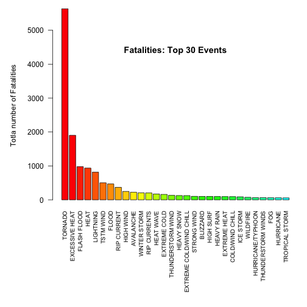
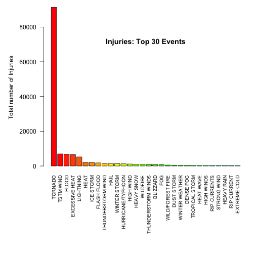
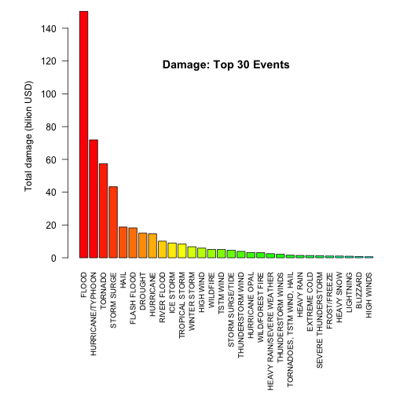

# Synopsis
Storms and other severe weather events can cause both public health and economic problems for communities and municipalities. Many severe events can result in fatalities, injuries, and property damage, and preventing such outcomes to the extent possible is a key concern.

This project involves exploring the U.S. National Oceanic and Atmospheric Administration's (NOAA) storm database. This database tracks characteristics of major storms and weather events in the United States, including when and where they occur, as well as estimates of any fatalities, injuries, and property damage.

# Useful libraries

```r
library(R.utils)
```

# Loadind the data

```r
url <- "https://d396qusza40orc.cloudfront.net/repdata%2Fdata%2FStormData.csv.bz2"
download.file (url, destfile = "data.csv.bz2", method="curl", quiet=TRUE)
bunzip2 ("data.csv.bz2", overwrite=TRUE, remove=FALSE, destname="data.csv") 
original_data <- read.csv ("data.csv", header=TRUE, stringsAsFactors=FALSE)
```

```r
dim (original_data)
```

```
## [1] 902297     37
```
``{r}
head (original_data)
```
# Data processing
Let consider only the observations of the original data set useful for our study

```r
data <- original_data[,c("STATE", "EVTYPE", "FATALITIES", "INJURIES", "PROPDMG", "PROPDMGEXP","CROPDMG", "CROPDMGEXP")]
```
and check if there is any missing value

```r
sum (is.na (data))
```

```
## [1] 0
```
We can now take a closer looka at the data to gain some insights

```r
head(data)
```

```
##   STATE  EVTYPE FATALITIES INJURIES PROPDMG PROPDMGEXP CROPDMG CROPDMGEXP
## 1    AL TORNADO          0       15    25.0          K       0           
## 2    AL TORNADO          0        0     2.5          K       0           
## 3    AL TORNADO          0        2    25.0          K       0           
## 4    AL TORNADO          0        2     2.5          K       0           
## 5    AL TORNADO          0        2     2.5          K       0           
## 6    AL TORNADO          0        6     2.5          K       0
```

```r
summary(data)
```

```
##     STATE              EVTYPE            FATALITIES      
##  Length:902297      Length:902297      Min.   :  0.0000  
##  Class :character   Class :character   1st Qu.:  0.0000  
##  Mode  :character   Mode  :character   Median :  0.0000  
##                                        Mean   :  0.0168  
##                                        3rd Qu.:  0.0000  
##                                        Max.   :583.0000  
##     INJURIES            PROPDMG         PROPDMGEXP       
##  Min.   :   0.0000   Min.   :   0.00   Length:902297     
##  1st Qu.:   0.0000   1st Qu.:   0.00   Class :character  
##  Median :   0.0000   Median :   0.00   Mode  :character  
##  Mean   :   0.1557   Mean   :  12.06                     
##  3rd Qu.:   0.0000   3rd Qu.:   0.50                     
##  Max.   :1700.0000   Max.   :5000.00                     
##     CROPDMG         CROPDMGEXP       
##  Min.   :  0.000   Length:902297     
##  1st Qu.:  0.000   Class :character  
##  Median :  0.000   Mode  :character  
##  Mean   :  1.527                     
##  3rd Qu.:  0.000                     
##  Max.   :990.000
```

# Results
The first question we want to answer is, across the United States, which types of events are most harmful with respect to population health?
## Fatalities
The histogram shows the total number of fatalities for the 30 top events, order by the total number of fatalities they have caused.

```r
fatal <- aggregate (FATALITIES~EVTYPE, data, sum)
fatal <- fatal [order(fatal$FATALITIES, decreasing=TRUE),]
par(mar=c(12, 6, 1, 1))
barplot (height = fatal$FATALITIES[1:30], names.arg = fatal$EVTYPE[1:30], las = 2, cex.names= 0.8,
         col = rainbow (30, start=0, end=0.5))
title (main = "Fatalities: Top 30 Events", line=-5)
title (ylab = "Totla number of Fatalities", line=4)
```

 
This shows that *excessive heat* and *tornado* cause most fatalities.

## Injuries
The histogram shows the total number of injuries for the 30 top events, order by the total number of injuries they have caused.

```r
injur <- aggregate (INJURIES~EVTYPE, data, sum)
injur <- injur [order(injur$INJURIES, decreasing=TRUE),]
par(mar=c(12, 6, 1, 1))
barplot (height = injur$INJURIES[1:30], names.arg = injur$EVTYPE[1:30], las = 2, cex.names = 0.8,
         col = rainbow (30, start=0, end=0.5))
title (main = "Injuries: Top 30 Events", line=-5)
title (ylab = "Total number of Injuries", line=4)
```

 
This shows that *winds* and *tornado* cause most injuries.

The second question we want to aswer is, across the United States, which types of events have the greatest economic consequences?

## Economic impact
We investigate here the total economic damage produced by each type of event, to evaluate those that caused the largest costs. Property and crop damages are summed-up over the years.

```r
symbol <- c("", "+", "-", "?", 0:9, "h", "H", "k", "K", "m", "M", "b", "B");
factor <- c(rep(0,4), 0:9, 2, 2, 3, 3, 6, 6, 9, 9)
multiplier <- data.frame (symbol, factor)

data$damage.prop <- data$PROPDMG*10^multiplier[match(data$PROPDMGEXP,multiplier$symbol),2]
data$damage.crop <- data$CROPDMG*10^multiplier[match(data$CROPDMGEXP,multiplier$symbol),2]
data$damage <- data$damage.prop + data$damage.crop

damage <- aggregate (damage~EVTYPE, data, sum);
damage$bilion <- damage$damage / 1e9;
damage <- damage [order(damage$bilion, decreasing=TRUE),]

par(mar=c(12, 6, 1, 1))
barplot (height = damage$bilion[1:30], names.arg = damage$EVTYPE[1:30], las = 2, cex.names = 0.8,
         col = rainbow (30, start=0, end=0.5))
title ("Damage: Top 30 Events", line=-5)
title (ylab = "Total damage (bilion USD)")
```

 
As opposed to previous results about human health, *flood* is the event that has caused the largest economic damage, as shown in the above histogram of the economic damage.

# Conclusion
*Tornado* is the event that has most affected human health, both in terms of fatalities and injuries, over the years from 1950 to 2011. On the other hand, *Flood* is the event linked to the largest economic damage.
